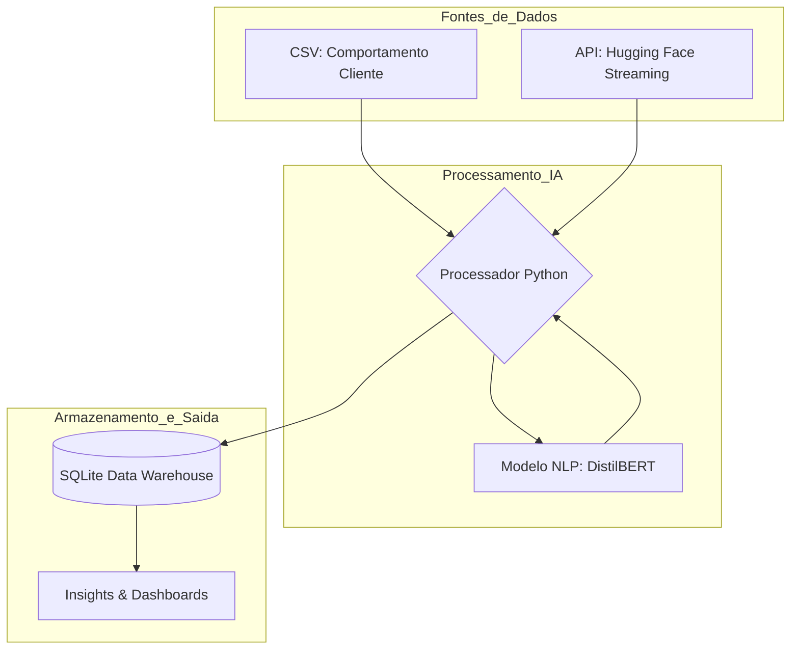

# Projeto: Inteligência de Dados no Retalho

## Sobre o Projeto
- Este sistema foi desenvolvido com o objetivo de criar uma solução robusta para o setor do retalho especializado. O foco principal é a análise holística do consumidor, cruzando dados transacionais e comportamentais com a dimensão emocional extraída através de inteligência artificial.

- Este trabalho foi inspirado e fundamentado nos princípios de Engenharia de Sistemas de Dados lecionados no Mestrado em Inteligênia Artificial, aplicando metodologias avançadas de integração de dados e análise de sentimentos para suporte à decisão.

## Arquitetura do Sistema
Aqui está a representação visual do pipeline que desenvolvi:

## Objetivos Implementados
- **Arquitetura Centralizada**: Implementação de um repositório único para dados provenientes de fontes heterogéneas.
- **IA e Sentimentos**: Extração de emoções e níveis de satisfação a partir de avaliações e comentários dos clientes para enriquecer os perfis tradicionais.
- **Modelação para Decisão**: Criação de indicadores de desempenho (KPIs) para personalização de ofertas e previsão de fidelidade.

## Arquitetura Técnica
- **Dados Estruturados**: Utilização do Customer Behaviour Dataset para caracterização demográfica e transacional.
- **Dados Não Estruturados**: Integração de avaliações da Amazon (via Hugging Face) para análise de opiniões.
- **Pipeline de IA**: Processamento de linguagem natural (NLP) para transformar texto subjetivo em dados quantitativos de sentimento.
- **Visualização**: Dashboards desenhados para diversos agentes de decisão empresariais.

### Stack Tecnológica
- **Linguagem**: Python 3.12.
- **IA/NLP**: Hugging Face Transformers (`DistilBERT` fine-tuned para análise de sentimentos).
- **Processamento de Dados**: Pandas para ETL e integração de fontes heterogéneas.
- **Armazenamento**: SQLite como Repositório Centralizado (Data Warehouse).
- **Visualização**: Matplotlib para geração de dashboards analíticos.

### Destaques de Engenharia
- **Ingestão Escalável**: Utilização de Streaming via Hugging Face Hub para processar grandes volumes de texto sem sobrecarregar a memória RAM.
- **Chave Sintética**: Implementação de uma lógica de integração por índice para correlacionar datasets sem chaves primárias comuns explícitas.
- **Resiliência**: Pipeline desenhado para adaptação rápida a diferentes fontes de dados (troca dinâmica entre datasets Amazon/IMDb).

## Resultados e KPIs
O sistema transforma dados brutos em indicadores acionáveis:
- **Segmentação por Sentimento**: Identificação automática de polaridade (Positive/Negative).
- **Métricas Demográficas**: Cálculo de idade média por nível de satisfação (Ex: Segmento de 43 anos com maior taxa de aprovação).
- **Distribuição de Género**: Mapeamento de padrões de crítica por perfil de cliente.
