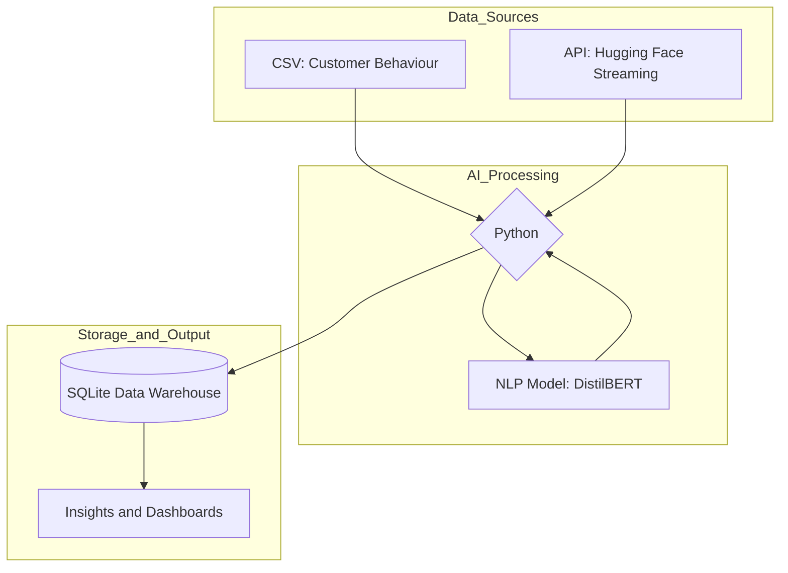

# Project: Retail Data Intelligence

## About the Project
This system was developed to provide a comprehensive solution for the retail sector.

The primary focus is on holistic consumer analysis, cross-referencing transactional and behavioural data with emotional dimensions extracted through Artificial Intelligence.

This work was inspired by and grounded in the principles of Data Systems Engineering taught in the Master's in Artificial Intelligence, applying data integration methodologies and sentiment analysis for decision support.

## System Architecture
Visual representation of the developed pipeline:

## Implemented Objectives
- **Centralised Architecture:** Implementation of a single repository for data originating from heterogeneous sources.
- **AI & Sentiment Analysis:** Extraction of emotions and satisfaction levels from customer reviews and comments to enrich traditional profiles.
- **Decision Modelling:** Creation of Key Performance Indicators (KPIs) for personalised offers and loyalty forecasting.

## Technical Architecture
- **Structured Data:** Utilisation of the Customer Behaviour Dataset for demographic and transactional characterisation.
- **Unstructured Data:** Integration of Amazon reviews (via Hugging Face) for opinion analysis.
- **AI Pipeline:** Natural Language Processing (NLP) to transform subjective text into quantitative sentiment data.
- **Visualisation:** Dashboards designed for business decision-making.

### Technology Stack
- **Language**: Python.
- **AI/NLP**: Hugging Face Transformers (`DistilBERT` fine-tuned para análise de sentimentos).
- **Data Processing**: Pandas para ETL e integração de fontes heterogéneas.
- **Storage**: SQLite como Repositório Centralizado (Data Warehouse).
- **Visualisation**: Matplotlib para geração de dashboards analíticos.

### Engineering Highlights
- **Scalable Ingestion**: Utilização de Streaming via Hugging Face Hub para processar grandes volumes de texto.
- **Synthetic Key**: Implementação de uma lógica de integração por índice para correlacionar datasets sem chaves primárias comuns explícitas.
- **Resilience**: Pipeline desenhado para adaptação rápida a diferentes fontes de dados.

## Results and KPIs
The system transforms raw data into actionable indicators:
- **Sentiment Segmentation:** Automatic identification of polarity (Positive/Negative).
- **Demographic Metrics:** Calculation of average age per satisfaction level (e.g., 43-year-old segment with the highest approval rate).
- **Gender Distribution:** Mapping of criticism patterns by customer profile.
